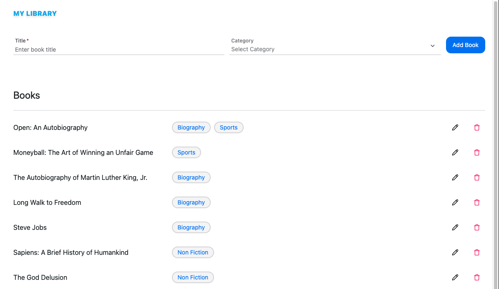
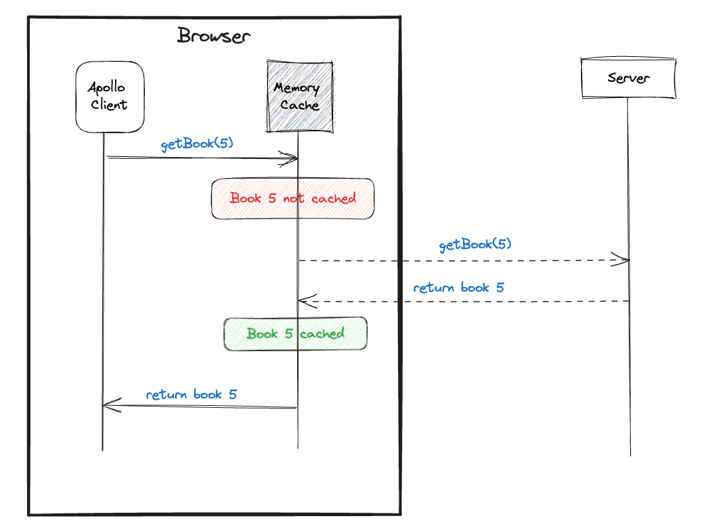
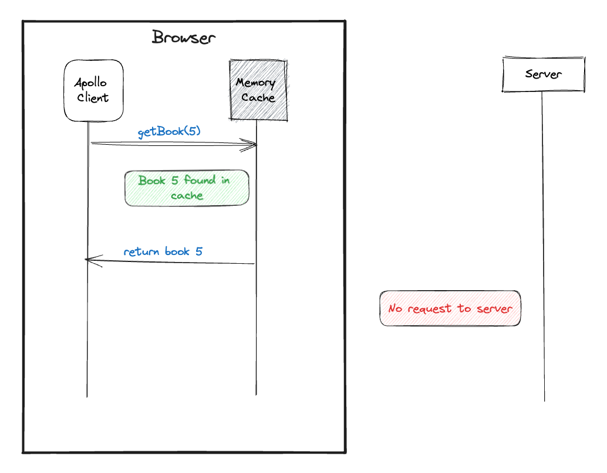

# Apollo Cache Cheat Sheet
<!-- TOC start (generated with https://github.com/derlin/bitdowntoc) -->
- [Context](#context)
    - [Code](#code)
    - [Schema](#schema)
    - [Data Sample](#data-sample)
- [How Apollo Caches Requests](#how-apollo-caches-requests)
    - [Initializing Cache](#initializing-cache)
    - [Query Caching](#query-caching)
- [Viewing Cache](#viewing-cache)
    - [Cache Normalization](#cache-normalization)
- [Adding Items to the Cache](#adding-items-to-the-cache)
    - [Method 1: Using `writeQuery` or `updateQuery`](#method-1-using-writequery-or-updatequery)
    - [Method 2: Using `cache.modify`](#method-2-using-cachemodify)
- [Handling Parameterized Queries](#handling-parameterized-queries)
- [Deleting Cache Items](#deleting-cache-items)
<!-- TOC end -->


# Context

This cheat sheet covers the most common use cases for managing Cache in Apollo Client, using a book library app as an example.

### Code

Checkout the repo or playground to see how I used the concepts in this guide:



- UI
    - [Apollo Client App (Github)](https://github.com/mujuni88/apollo-client-books)
    - [Codesandbox](https://codesandbox.io/p/sandbox/apollo-client-books-mpf42p)
- Server
    - [Apollo Server (Github)](https://github.com/mujuni88/apollo-server-books)
    - [Codesandbox](https://codesandbox.io/s/apollo-server-book-js-h25j89)

### Schema

```graphql
  enum Category {
    FICTION
    NON_FICTION
    BIOGRAPHY
    SPORTS
  }
  
  type Query {
    books(filter: BookFilter): [Book]
    book(id: String!): Book
  }

  type Book {
    id: String!
    title: String!
    categories: [Category]
  }

  type Mutation {
    addBook(title: String!, categories: [Category]): Book
    updateBook(id: String!, title: String!, categories: [Category]): Book
    deleteBook(id: String!): Boolean
  }

  input BookFilter {
    category: Category
  }

```

### Data Sample

```jsx
const books = [
  { title: "To Kill a Mockingbird", categories: ["FICTION"] },
  { title: "1984", categories: ["FICTION"] },
  { title: "Harry Potter and the Sorcerer's Stone", categories: ["FICTION"] },
  { title: "The Great Gatsby", categories: ["FICTION"] },
  { title: "The Diary of a Young Girl", categories: ["BIOGRAPHY"] },
  { title: "The Catcher in the Rye", categories: ["FICTION"] },
];
```

# How Apollo Caches Requests

### Initializing Cache

Initialize your Apollo client with `InMemoryCache`.

```graphql
import { ApolloClient, InMemoryCache } from "@apollo/client";

const client = new ApolloClient({
  uri: "https://your-api-endpoint.com",
  cache: new InMemoryCache()
});
```

### Query Caching

When you query a book for the first time, Apollo initiates a network request. 



All subsequent requests of the same type will hit the cache



# Viewing Cache

To view the cache, use:

- `window.__APOLLO_CLIENT__.cache.extract()` in your browser console
- [Download Apollo Client Devtools](https://www.apollographql.com/docs/react/development-testing/developer-tooling/#apollo-client-devtools)

### Cache Normalization

By default, cache identifiers have the format `<__typename>:<id>`. For example, if you're querying a `Book` with an id of `harry-potter`, the cache would store it as `"Book:harry-potter"`.

```graphql
{
    "ROOT_QUERY": {
        "__typename": "Query",
        "books": [
            {
                "__ref": "Book:harry-potter"
            },
            {
                "__ref": "Book:lord-of-the-rings"
            }
        ]
    },
    "Book:harry-potter": {
        "__typename": "Book",
        "id": "harry-potter",
        "title": "Harry Potter"
    },
    "Book:lord-of-the-rings": {
        "__typename": "Book",
        "id": "lord-of-the-rings",
        "title": "Lord Of The Rings"
    },
}
```

# Adding Items to the Cache

### Method 1: Using `writeQuery` or `updateQuery`

**Long Way: Using readQuery and writeQuery**

```jsx
const [addBook] = useMutation(
    ADD_BOOK,
    {
      update(cache, { data: { addBook } }) {
        const { books } = cache.readQuery({ query: GET_BOOKS });
        cache.writeQuery({
          query: GET_BOOKS,
          data: { books: books.concat([addBook]) },
        });
      }
    }
);

```

**Short Way: Using updateQuery**

```jsx
const [addBook] = useMutation(
    ADD_BOOK,
    {
      update(cache, { data: { addBook } }) {
        const query = GET_BOOKS;
        cache.updateQuery({query}, (data) => ({
          books: [...data.books, addBook]
        }));
      }
    }
);

```

### Method 2: Using `cache.modify`

**Long way:**

```jsx
const [mutate] = useMutation(
    ADD_BOOK,
    {
      update (cache, { data }) {
        const newBook = data?.addBook;
     
        cache.modify({
					fields: {
						books(prevBooks, {toReference}){
							const newBookRef = cache.writeFragment({
                    data: newBook,
                    fragment: gql`
                        fragment NewBook on Book {
                            id
                            title
                        }
                    `
                });
							return [...prevBooks, newBookRef]
						}
					}
				});
      }
    }
  )
```

**Simpler way**

```jsx
const [mutate] = useMutation(
    ADD_BOOK,
    {
      update (cache, { data }) {
        const newBook = data?.addBook;
     
        cache.modify({
					fields: {
						books(prevBooks, {toReference}){
							return [...prevBooks, toReference(newBook)]
						}
					}
				});
      }
    }
  )
```

Difference between `toReference` and `writeFragment`

The `toReference` function returns a reference to a cache object that already exists, while `writeFragment` writes an object to the cache and then returns its reference. It is important to remember that any results returned by mutations or queries are first cached before being returned to the client. This is why `toReference` works.

# Handling Parameterized Queries

Handling pagination or filters/sorts can be done by parsing the `storeFieldName` provided in your field function.

Example: Say I ran the following queries to filter books by category:

```jsx
getBooks(category: 'FICTION')
getBooks(category: 'BIOGRAPHY')
```

The cache will look like the following:

```jsx
{
    "ROOT_QUERY": {
        "__typename": "Query",
        "books({\"filter\":{\"category\":\"FICTION\"}})": [
            { "__ref": "Book:to-kill-a-mockingbird" },
            { "__ref": "Book:1984" },
            { "__ref": "Book:war-and-peace" },
            { "__ref": "Book:the-odyssey" }
        ],
        "books({\"filter\":{\"category\":\"BIOGRAPHY\"}})": [
            { "__ref": "Book:the-diary-of-a-young-girl" },
            { "__ref": "Book:steve-jobs" },
        ]
    }
}
```

Let’s say you wanted to add a new book to the list eg:

```jsx
addBook({ variables: { title: 'Benjamin Franklin', categories: ["BIOGRAPHY"] } });
```

How do you update the cache?

**The wrong way:**

```jsx
addBook({
 variables: { title:"Benjamin Franklin", category: "BIOGRAPHY"}
},
update: (cache, {data}) => {
    cache.modify({
        fields: {
            books: (previous, { toReference }) => (
                [...previous, toReference(data.addBook)]
            )
        }
    });
}
})
```

Why? this will add the new book in all the `categories` but we only want to add this book to the `BIOGRAPHY` category. 

**Solution:**

Parse the `storeFieldName` that is provided in your field function. You can use the following utility function:

```jsx
/**
 * Takes in storeFieldName eg "books({"filter":{"category": "BIOGRAPHY"}})"
 * Returns { "filter":{"category": "BIOGRAPHY"}}
 */  
function getParamsFromStoreFieldName(storeFieldName) {
  try {
    // find the index of the first & last curly bracket
    const first = storeFieldName.indexOf('{');
    const last = storeFieldName.lastIndexOf('}');
    
    // check if curly brackets were found
    if (first === -1 || last === -1) {
      throw new Error('No parameters found in the provided storeFieldName.');
    }
  
    // extract the params
    const json = storeFieldName.slice(first, last + 1);
  
    // attempt to parse the SON
    return JSON.parse(json);
  } catch (error) {
    console.error(`Failed to parse parameters from storeFieldName: ${error.message}`);
    return null;
  }
}
```

Using `getParamsFromStoreFieldName`

```jsx
const [addBook, { data }] = useMutation(ADD_BOOK, {
    update(cache, { data: { addBook } }) {
      cache.modify({
        fields: {
          books(previous, { toReference, storeFieldName }) {
            // storeFieldName = books({"filter":{"category": "BIOGRAPHY"}})
            const params = getParamsFromStoreFieldName(storeFieldName);

            if (params?.filter?.category) {
              const category = params.filter.category;

              if (category === addBook.category) {
                return [...previous, toReference(addBook)];
              }
            } else {
              // If no filter is applied or the filter is not based on category, just append the new book
              return [...previous, toReference(addBook)];
            }

            return previous;
          }
        }
      });
    }
});
```

# Deleting Cache Items

Best way to delete cache items. Note: `cache.evict` and `cache.gc`

```jsx
const [deleteBook] = useMutation(DELETE_BOOK_MUTATION, {
  update(cache, { data }) {
    if (data.deleteBook) {
      cache.modify({
        fields: {
          books(existingBooks, { readField }) {
            return existingBooks.filter(
              (bookRef) => readField('id', bookRef) !== data.deleteBook.id
            );
          },
        },
      });

      /*
        Clean up:
        Remove the specified cache object from the cache along with all references to it
        on any other cache objects.
      */		
      cache.evict({ id: cache.identify(data.deleteBook) });
      cache.gc();
    }
  },
});
```
